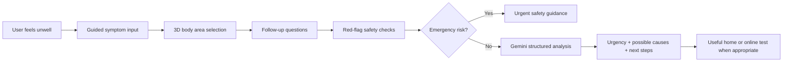

# 🩺 60 Second Care

**A first layer of healthcare — built for The Gemma 4 Good Hackathon, a Kaggle-hosted competition sponsored by Google LLC and associated with Google DeepMind.**

60 Second Care is an MVP health-check web application designed around one simple idea:

## Accurate Input → Better Result → Prove It at Home

Most healthcare guidance tools depend on the quality of the information the user gives them. If the input is vague, the result can be vague too.

60 Second Care focuses on improving the first step: helping users describe symptoms clearly, structure the information safely, and take a practical next action.

```text
┌──────────────────┐       ┌──────────────────┐       ┌──────────────────────┐
│  Accurate Input  │  -->  │  Better Result   │  -->  │   Prove It at Home   │
└──────────────────┘       └──────────────────┘       └──────────────────────┘
        │                          │                            │
        v                          v                            v
 Guided questions           Urgency guidance              Suggested home or
 + 3D body selection        + possible causes             online-orderable test
 + symptom context          + next steps                  when useful
```

## The Core Vision

### 1. Accurate Input

60 Second Care helps the user provide better symptom information by collecting:

- basic health context
- symptom description
- selected body area using a 3D model
- severity
- duration
- medication use
- allergies and medical history
- warning signs and red-flag answers

The goal is to turn uncertain, vague symptom descriptions into structured information that is easier to reason about.

### 2. Better Result

The app uses a layered safety-first workflow:

```text
User symptoms
     ↓
Guided input + 3D body area selection
     ↓
Structured health payload
     ↓
Rule-based red-flag checks
     ↓
Gemini AI analysis if no emergency red flags are detected
     ↓
Clear guidance, urgency level, possible causes, and next steps
```

This makes the result more useful because the AI is not working from a loose paragraph. It receives structured context collected through a focused health-check flow.

### 3. Prove It at Home

Where appropriate, the app recommends one useful home or online-orderable test. The purpose is not to diagnose the user, but to help them collect practical evidence and decide what to do next.

Examples include:

- COVID lateral flow test
- thermometer
- blood pressure monitor
- urine dipstick test
- pregnancy test
- peak flow meter
- HbA1c finger-prick test
- ferritin test
- thyroid TSH test

This creates a stronger action loop:

```text
Describe better → Understand better → Test when useful → Act sooner
```

## Product Promise

```text
Better data in.
Better guidance out.
A practical next step users can take at home.
```

60 Second Care is not a diagnostic system and does not replace professional medical advice. It is designed as a first layer: a fast, structured, safety-aware step before deciding whether to self-care, monitor, test, contact a doctor, or seek urgent help.

## Why This Matters For The Hackathon

For the competition, the main product message is:

> 60 Second Care improves the quality of the health input first, so the output becomes clearer, safer, and more actionable.

The app does not simply ask “what is wrong?” and return AI text. It guides the user through a structured journey:



---

## Inspiration

I built 60 Second Care because I am genuinely passionate about healthcare and how technology can make it more accessible, faster, and easier to understand.

The idea came from my own experience struggling with healthcare access in the UK, especially for simple issues. Sometimes a symptom feels worrying, but it is not clear whether it needs a doctor, urgent care, self-care, monitoring, or better information first.

Getting an appointment can take time, online searches can be confusing, and people often do not know what information is useful before speaking to a clinician.

That gap inspired this project: a tool that helps people collect the right information quickly and turn it into practical next steps.

## Project Overview

60 Second Care is an MVP healthcare guidance application that helps users complete a short health check in around one minute.

It does **not** try to replace doctors or diagnose users. Instead, it acts as a first layer of healthcare: a guided, structured step before a user decides what to do next.

The final result gives the user:

- 🚨 an urgency level
- 🧠 a possible explanation
- 📊 confidence level
- ⚠️ possible causes
- ✅ what they can do now
- 📞 when to seek help
- 📝 a doctor summary
- 🧪 where useful, a recommended home or online-orderable test

## Technical Stack

The MVP is built as a traditional PHP multi-page web application designed for a local XAMPP / Apache environment.

- **Backend:** PHP
- **Database:** MySQL with PDO
- **Frontend:** JavaScript, Tailwind CSS, custom CSS
- **AI:** Google Gemini / Gemma through the Google Generative Language API
- **3D interaction:** `<model-viewer>` with a GLB body model
- **Session state:** PHP sessions
- **Storage model:** anonymous database save only after consent

## Project Structure

```text
public_html/
├── index.php                 # Landing and profile onboarding
├── describe.php              # Symptom description and 3D body selection
├── location.php              # Follow-up questions, severity, medication, context
├── loading.php               # Loading screen that submits to backend analysis
├── result.php                # Final guidance, doctor summary, feedback actions
├── schema.sql                # Database schema
│
├── api/
│   ├── health-check.php      # Main health-check endpoint
│   └── feedback.php          # Feedback save endpoint
│
├── includes/
│   ├── session.php           # Session handling, input normalization, payload builder
│   ├── redflags.php          # Rule-based emergency / red-flag checks
│   ├── gemini.php            # Gemini prompt building, API call, JSON validation
│   └── db.php                # PDO connection and consented database storage
│
└── assets/
    ├── app.js                # Frontend interactions, 3D body picker, forms, feedback
    ├── style.css             # Custom styling
    └── 3d/male_body.glb      # MVP 3D body model
```

## Application Flow

```text
index.php
   ↓
describe.php
   ↓
location.php
   ↓
loading.php
   ↓
api/health-check.php
   ↓
result.php
```

The user journey is split into focused steps so the application can collect structured context instead of depending on a single vague symptom paragraph.

1. **Landing and profile context**  
   `index.php` collects basic profile details such as age, sex, location, conditions, and allergies.

2. **Symptom description and body area**  
   `describe.php` collects the main symptom description, pain quality, onset, and selected body area through the 3D model.

3. **Follow-up details**  
   `location.php` collects duration, severity, medication use, associated symptoms, warning signs, and extra context.

4. **Safety and AI processing**  
   `loading.php` sends the structured session data to `api/health-check.php`.

5. **Result and action**  
   `result.php` displays urgency, possible causes, next steps, doctor summary, and a useful test when appropriate.

## System Architecture

```text
[User Browser]
      |
      v
[PHP Screens]
index.php → describe.php → location.php → loading.php
      |
      v
[PHP Session State]
profile + issue + body area + follow-up + context
      |
      v
[api/health-check.php]
      |
      +--> [includes/redflags.php]
      |        |
      |        +--> emergency_result() if red flags are matched
      |
      +--> [includes/gemini.php]
      |        |
      |        +--> Google Gemini / Gemma structured JSON response
      |
      +--> validate_ai_result()
      |
      +--> optional save_consent_and_session()
      |
      v
[result.php]
```

## Backend Architecture

The backend uses PHP sessions to carry the health check across multiple screens. Each step saves only its own part of the form, then the final endpoint combines everything into a structured payload.

Important session areas include:

- `profile` — age, sex, location, medical history, allergies
- `issue` — symptom description, body area, pain quality, onset
- `followup` — duration, severity, warning symptoms, associated symptoms
- `context` — medication use and additional context
- `result` — final health guidance shown to the user
- `anonymous_session_id` — random anonymous session identifier

The final backend endpoint, `api/health-check.php`, follows this order:

```text
Collect session data
     ↓
Build structured health payload
     ↓
Run rule-based red-flag checks
     ↓
If emergency risk exists: return emergency guidance without AI
     ↓
If no emergency red flags: call Gemini / Gemma
     ↓
Validate and sanitize AI JSON
     ↓
Use fallback result if AI fails
     ↓
Save anonymous summary only if user gave consent
     ↓
Redirect to result page
```

This design keeps safety-critical decisions separate from AI-generated guidance.

## Rule-Based Red-Flag Safety Layer

Before Gemini is called, the app checks for urgent warning signs using deterministic PHP rules.

Examples of red-flag categories include:

- chest pain with breathing difficulty, sweating, or radiating pain
- sudden severe headache
- weakness, numbness, speech difficulty, confusion, or vision loss
- fainting or collapse
- severe bleeding
- breathing or swallowing problems with swelling
- back pain with bladder or bowel loss
- pregnancy with severe abdominal pain
- severe abdominal pain with blood in vomit or stool

If a red flag is detected, the app does **not** continue to normal AI guidance. It returns an emergency-focused result from the rule engine.

```text
collect_health_check()
      ↓
check_red_flags()
      ↓
Emergency risk?
      ├── Yes → emergency_result() → result.php
      └── No  → Gemini structured analysis
```

## Gemini / Gemma AI Integration

Gemini is used only after rule-based safety checks pass.

The AI integration is handled in `includes/gemini.php`, which is responsible for:

- building the system prompt
- building the user prompt from structured session data
- calling the Google Generative Language API
- requesting JSON output
- enforcing a response schema
- parsing the returned response
- validating the final result
- falling back safely if the model fails

The app does not send Gemini a loose paragraph alone. It sends a structured health payload containing profile context, selected body area, symptom details, severity, duration, medication use, allergies, medical history, associated symptoms, and red-flag answers.

The expected AI response includes fields such as:

- `urgencyLevel`
- `mostLikelyExplanation`
- `confidence`
- `possibleCauses`
- `recommendedTests`
- `recommendedTestReason`
- `whatToDoNow`
- `whenToSeekHelp`
- `doctorQuestions`
- `doctorSummary`
- `regionalViralNote`

The output is validated before it is shown to the user. If the API fails, returns invalid JSON, or misses required fields, the app uses a conservative fallback result instead of exposing unreliable raw output.

```text
Gemini response
      ↓
JSON parse
      ↓
Required fields check
      ↓
Urgency / confidence normalization
      ↓
Text and list cleanup
      ↓
Valid result or safe fallback
```

## Why The 3D Body Model Matters

One of the most important parts of the project is the interactive 3D body model.

A common problem in healthcare is that people describe symptoms vaguely. They might say “pain here” or “near my side,” but that can be difficult for a system to interpret.

The 3D body model helps convert that vague feeling into a structured body-area signal.

The MVP lets users select areas such as:

- head
- neck
- chest
- stomach
- arm
- leg
- upper back
- lower back

That selected area changes what the app asks next. For example, chest symptoms trigger different safety follow-ups than head, stomach, or leg symptoms.

Technically, this is useful because the selected `body_area` influences:

- associated symptom options
- conditional red-flag questions
- the structured payload sent to Gemini
- the relevance of the final guidance

Current MVP limitation: the model uses coarse body regions and a single static body model. Future versions should include more precise anatomical mapping, side-specific selection, and improved accessibility.

## Database and Consent-Based Storage

The app is session-only by default. Anonymous data is saved to MySQL only when the user gives consent.

The database contains three main tables:

- `health_check_sessions` — anonymous health-check summary
- `health_check_feedback` — user feedback linked to an anonymous session
- `consent_records` — consent event tracking

The stored session summary can include fields such as:

- age range
- sex
- selected body area
- symptom duration
- severity
- whether a red flag was triggered
- urgency level
- confidence
- model identifier
- app version

This is useful for improving the product while avoiding a user-account-based design. However, future versions should strengthen privacy by reducing location precision, redacting free text, adding retention controls, and considering encryption for sensitive stored fields.

## Value Proof: How The Implementation Supports The Vision

### Accurate Input

The codebase supports better input through:

- structured multi-step forms
- 3D body-area selection
- severity scoring
- duration and onset collection
- medication and allergy context
- medical history fields
- associated symptom selection
- warning-sign questions

This creates more reliable context than a single free-text symptom box.

### Better Result

The result is improved through:

- deterministic red-flag checks before AI
- a structured health payload
- controlled Gemini system and user prompts
- JSON response schema enforcement
- server-side validation and sanitization
- conservative fallback behavior
- a doctor-facing summary

The AI is used as a guided analysis layer, not as an uncontrolled chatbot.

### Prove It at Home

The app supports action by recommending one useful test or monitoring tool when appropriate.

This helps the user move from uncertainty to evidence-gathering. The goal is not to diagnose at home, but to help the user collect useful information before deciding whether to self-care, monitor, contact a doctor, or seek urgent help.

```text
Structured symptom input
        ↓
Safer urgency guidance
        ↓
Recommended next step
        ↓
Useful test or monitoring tool
        ↓
More informed action
```

## Result Page Output

The result page is designed to be practical rather than only informational.

It can show:

- urgency level
- likely explanation
- confidence level
- possible causes
- what to do now
- when to seek help
- recommended tests
- reason for the suggested test
- questions to ask a doctor
- doctor summary
- feedback actions
- download / copy options

This makes the result more useful for both the user and a clinician.

## Current MVP Limitations

60 Second Care is a proof-of-concept MVP. Important limitations remain:

- no clinical validation study has been completed
- red-flag rules need review against clinical triage standards
- the 3D body model is coarse and not anatomically precise
- the body model is not yet personalized by sex, age, or body type
- AI output depends on user-provided information
- stored free text may contain sensitive details if the user consents to storage
- there is no full retention or deletion workflow yet
- `regionalViralNote` currently depends too much on model reasoning instead of live public-health data
- the app should not be used as a diagnosis system

## Future Improvements

Planned or recommended improvements include:

- more accurate 3D anatomical selection
- side-specific body mapping
- clinician-reviewed red-flag rules
- clinical validation of urgency recommendations
- test-provider and pharmacy integration
- stronger privacy controls and data minimization
- data retention and deletion workflows
- encrypted storage for sensitive fields
- multilingual support
- accessibility improvements
- personalized follow-up after test results
- automated tests and CI checks for AI prompt / response handling
- live epidemiology feeds from public-health APIs for `regionalViralNote` instead of relying on the model alone

## Safety Notice

60 Second Care is not a diagnostic system. It does not replace professional medical advice, diagnosis, or treatment.

If emergency red flags are detected, the app prioritizes urgent safety guidance instead of continuing with normal AI analysis.

Users should contact emergency services or a qualified healthcare professional when symptoms are severe, worsening, unusual, or concerning.

## Conclusion

**60 Second Care** was created from a **real frustration with healthcare access** and a belief that **technology can improve the first step of care**.

It is **not a doctor**. It is **not a diagnosis engine**. It is a **first layer**.

It helps people **pause**, **describe what is happening**, **collect better information**, **check for danger signs**, and **take action**.

That is what **accessible healthcare** should feel like: **fast**, **clear**, **careful**, and **available to everyone**.
