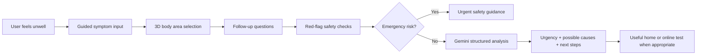

# 🩺 60 Second Care

**A first layer of healthcare — built for a Google hackathon competition hosted on Kaggle.**

60 Second Care is an MVP health-check web application designed around one simple idea:

## Accurate Input → Better Result → Prove It at Home

Most healthcare guidance tools depend on the quality of the information the user gives them. If the input is vague, the result can be vague too.

60 Second Care focuses on improving the first step: helping users describe symptoms clearly, structure the information safely, and take a practical next action.

```text
┌──────────────────┐       ┌──────────────────┐       ┌──────────────────────┐
│  Accurate Input  │  -->  │  Better Result   │  -->  │   Prove It at Home   │
└──────────────────┘       └──────────────────┘       └──────────────────────┘
        │                          │                            │
        v                          v                            v
 Guided questions           Urgency guidance              Suggested home or
 + 3D body selection        + possible causes             online-orderable test
 + symptom context          + next steps                  when useful
```

## The Core Vision

### 1. Accurate Input

60 Second Care helps the user provide better symptom information by collecting:

- basic health context
- symptom description
- selected body area using a 3D model
- severity
- duration
- medication use
- allergies and medical history
- warning signs and red-flag answers

The goal is to turn uncertain, vague symptom descriptions into structured information that is easier to reason about.

### 2. Better Result

The app uses a layered safety-first workflow:

```text
User symptoms
     ↓
Guided input + 3D body area selection
     ↓
Structured health payload
     ↓
Rule-based red-flag checks
     ↓
Gemini AI analysis if no emergency red flags are detected
     ↓
Clear guidance, urgency level, possible causes, and next steps
```

This makes the result more useful because the AI is not working from a loose paragraph. It receives structured context collected through a focused health-check flow.

### 3. Prove It at Home

Where appropriate, the app recommends one useful home or online-orderable test. The purpose is not to diagnose the user, but to help them collect practical evidence and decide what to do next.

Examples include:

- COVID lateral flow test
- thermometer
- blood pressure monitor
- urine dipstick test
- pregnancy test
- peak flow meter
- HbA1c finger-prick test
- ferritin test
- thyroid TSH test

This creates a stronger action loop:

```text
Describe better → Understand better → Test when useful → Act sooner
```

## Product Promise

```text
Better data in.
Better guidance out.
A practical next step users can take at home.
```

60 Second Care is not a diagnostic system and does not replace professional medical advice. It is designed as a first layer: a fast, structured, safety-aware step before deciding whether to self-care, monitor, test, contact a doctor, or seek urgent help.

## Why This Matters For The Hackathon

For the competition, the main product message is:

> 60 Second Care improves the quality of the health input first, so the output becomes clearer, safer, and more actionable.

The app does not simply ask “what is wrong?” and return AI text. It guides the user through a structured journey:



---

# Original README Content

The following section keeps the original project explanation and story as provided.

🩺60 Second Care: A First Layer of Healthcare
💡 Inspiration

I built 60 Second Care because I am genuinely passionate about healthcare and how technology can make it more accessible, faster, and easier to understand.

The idea came from my own experience struggling with healthcare in the UK, especially for simple issues. Sometimes you have a symptom that feels worrying, but you are not sure whether it needs a doctor, urgent care, self-care, or just better monitoring. Getting an appointment can take time, online searches can be confusing, and people often do not know what information is actually useful before speaking to a clinician.

That gap inspired me to build a tool that helps people collect the right information quickly and turn it into practical next steps.
Project Overview

60 Second Care is an MVP healthcare guidance application that helps users complete a short health check in around one minute.

The project does not try to replace doctors or diagnose users. Instead, it acts as a first layer of healthcare: a guided, structured step before a user decides what to do next.

The app asks the user for:

basic health context
symptoms
body location
severity
duration
medication use
warning signs
medical history
It then uses a combination of rule-based safety checks and AI analysis to produce clear guidance.

The final result gives the user:

🚨 an urgency level
🧠 a possible explanation
📊 confidence level
⚠️ possible causes
✅ what they can do now
📞 when to seek help
📝 a doctor summary
🧪 and, where useful, a recommended home or online-orderable test
🧍 The Role Of The 3D Body Model

One of the most important parts of the project is the interactive 3D body model.

A common problem in healthcare is that people describe symptoms in vague ways. They might say “pain here” or “near my side,” but that is difficult for a system to interpret. The 3D model helps convert that vague feeling into structured information.

The user can select a body area such as:

head
neck
chest
stomach
arm
l- eg
upper back
lower back
This selected body area then affects the rest of the health check. For example, chest symptoms trigger different follow-up questions than stomach symptoms or head symptoms. This makes the app more focused and more useful.

The 3D model is currently part of the MVP, but the long-term goal is to make it much more precise, with better anatomical mapping and more accurate body-region selection.

⚙️How The System Works

The project is built as a PHP web application with JavaScript, MySQL, and Google Gemini AI.

The architecture has several layers:

1️⃣ User input layer

The user enters profile details, symptoms, medical context, and body location.

2️⃣ 3D body selection layer

The model helps collect structured body-area information.

3️⃣ Session data layer

The app stores answers temporarily in PHP sessions while the user moves through the flow.

4️⃣ Rule-based red-flag layer

Before AI is used, the app checks for urgent warning signs such as chest pain with breathing trouble, sudden severe headache, fainting, confusion, or severe bleeding.

5️⃣ AI analysis layer

If no emergency red flags are detected, the structured information is sent to Gemini to generate safe, practical guidance.

6️⃣ Action layer

The result page gives users next steps and may recommend a specific test or monitoring tool.

This layered design is important because healthcare apps must be cautious. AI is helpful, but emergency safety rules should come first.

🤖Gemini / Gemma AI Integration

The Gemini/Gemma integration was designed to be structured, controlled, and safety-focused. In a healthcare context, I did not want to send the model a loose paragraph and rely on an open-ended response. Instead, the app collects the user’s information step by step and converts it into a structured health payload before calling the model.

The prompt is split into two parts:

🛡️ a system prompt, which defines the model’s role, safety boundaries, tone, and output rules
📥 a user prompt, which contains the actual health-check data collected from the user

The system prompt tells the model:

-not to diagnose
-not to claim certainty
-not to replace a clinician
-to prioritise urgent or emergency guidance when risk is present

It also requires the model to return only valid JSON in a fixed schema. This makes the response easier to validate, display, and safely control inside the application.

The user prompt is built from structured session data, including:

age
sex
location
selected body area
symptom description
onset
severity
duration
medication use
allergies
medical history
associated symptoms
red-flag answers

This helps the model reason from consistent inputs instead of vague free text.

The Gemini API call is implemented in a dedicated backend module. The application builds the prompts, sends them to the Google Generative AI endpoint, and requests a JSON response containing fields such as:

urgency level
likely explanation
confidence
possible causes
recommended test
next steps
when to seek help
doctor questions
doctor summary

Before the result is shown to the user, the response is validated. If the model returns invalid JSON, misses required fields, or the API fails, the app falls back to a safer default result. This prevents raw or unreliable model output from being shown directly.

In the current MVP, Gemini is mainly used at the final analysis stage. In an improved version, the system would make many more API calls throughout the journey. For example, Gemini could dynamically generate follow-up questions based on the user’s previous answers, selected body area, symptom severity, and medical context.

This would allow the health check to become more personalised and adaptive, while still keeping strict validation and red-flag rules around every step.

This structured approach matters because healthcare AI needs reliability. By controlling the prompt, enforcing JSON output, validating the response, and combining AI with rule-based safety checks, the app makes Gemini useful as a guided decision-support layer rather than an uncontrolled chatbot.

🧪 Helping Users Take Action Through Tests

A major part of 60 Second Care is helping users take action, not just giving them information.

When useful, the app recommends one specific test or tool that could help the user collect better evidence. For example:

COVID lateral flow test
thermometer
blood pressure monitor
urine dipstick test
pregnancy test
peak flow meter
thyroid TSH test
ferritin test
HbA1c finger-prick test

The idea is that users can run a test, collect real data, and then make a better decision about what to do next.

This is powerful because many people do not know what information is useful before contacting a doctor. 60 Second Care helps bridge that gap.

❤️ Why This Matters To Me

Healthcare is one of the areas where technology can have a huge human impact.

I also showed 60 Second Care to my doctor, Hudson, and he genuinely liked the idea and the direction of the project. He mentioned that he has even seen some patients cancel appointments after using AI tools for guidance. However, he also pointed out that most AI healthcare experiences today are not well organised or structured, which can make them confusing or unreliable for users.

That conversation reinforced my belief that healthcare AI needs better structure, stronger safety layers, and clearer guidance for everyday people. I care about this because everyone deserves clearer access to health information, especially when they feel worried, uncertain, or ignored.

I want 60 Second Care to become available to everyone, regardless of background, location, or confidence with healthcare systems.

For me, the goal is not to replace healthcare professionals. The goal is to support people before they reach that point. I see this as the first layer of healthcare: a quick, accessible, structured check that helps people understand whether they can self-care, monitor, test, contact a doctor, or seek urgent help.

I believe 60 Second Care does this very well for an MVP. It collects useful information quickly, focuses the user through the 3D body model, checks for danger signs, and gives practical next steps.

🚀 MVP And Future Vision

This is only the first version.

The current MVP proves the core idea, but future improvements could include:

more accurate 3D anatomical selection
live public-health and viral outbreak data
more advanced symptom pathways
integration with pharmacies and testing providers
multilingual support
accessibility improvements
clinician-reviewed safety rules
stronger privacy and data controls
personalized follow-up after test results

My long-term vision is to make 60 Second Care a trusted first step for everyday health concerns. A tool that helps people feel less lost, collect better information, and take the right action sooner.

✅Conclusion

60 Second Care was created from a real frustration with healthcare access, but also from a strong belief that technology can improve the first step of care.

It is not a doctor. It is not a diagnosis engine. It is a first layer.

It helps people pause, describe what is happening, collect better information, check for danger signs, and take action.

That is what I believe the future of accessible healthcare should feel like: fast, clear, careful, and available to everyone.
